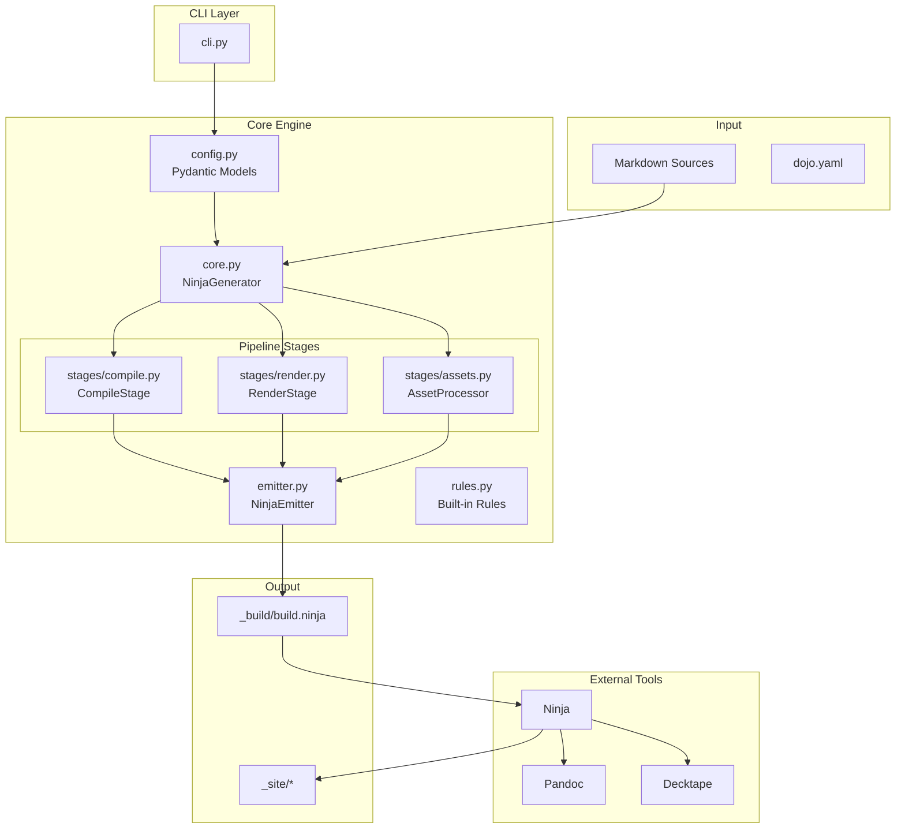

# Dojo Architecture

> Ninja Build Generator for Static Site Generation

## Overview

Dojo transforms Markdown content into optimized static websites using [Ninja](https://ninja-build.org/) for fast, incremental builds and [Pandoc](https://pandoc.org/) for flexible document conversion.

## Architecture Diagram



## Module Responsibilities

| Module              | Purpose                            | Key Classes/Functions                   |
| ------------------- | ---------------------------------- | --------------------------------------- |
| `cli.py`            | Command-line interface             | `main()`, `cmd_build()`, `cmd_schema()` |
| `config.py`         | Configuration loading & validation | `Config`, `TypeConfig`, `OutputConfig`  |
| `core.py`           | Pipeline orchestration             | `NinjaGenerator`                        |
| `stages/compile.py` | Markdown → JSON AST                | `CompileStage`                          |
| `stages/render.py`  | JSON → Output formats              | `RenderStage`                           |
| `stages/assets.py`  | Asset dependency copying           | `AssetProcessor`                        |
| `emitter.py`        | Ninja syntax generation            | `NinjaEmitter`                          |
| `rules.py`          | Built-in Ninja rules               | `get_builtin_rules()`                   |
| `plugins.py`        | Plugin interface                   | `PluginInterface`, `load_plugin()`      |
| `schema.py`         | JSON Schema export                 | `generate_schema()`                     |

## Build Pipeline Stages

### 1. Compile Stage

**Input:** Markdown files\
**Output:** JSON AST files in `_build/`\
**Tool:** Pandoc with `-t json`

The compile stage parses Markdown with YAML frontmatter and produces a Pandoc AST (Abstract Syntax Tree) in JSON format. This intermediate representation enables:

- Programmatic content inspection
- Dependency tracking via Lua filters
- Multiple output formats from single source

### 2. Render Stage

**Input:** JSON AST\
**Output:** HTML, PDF, or other formats in `_site/`\
**Tool:** Pandoc with format-specific options

The render stage transforms JSON AST to final formats using Pandoc's rich output capabilities. Key features:

- Format-specific templates and defaults
- Post-processing hooks (minification, or multi-step pipelines)
- Derived outputs (HTML → PDF via Decktape, which can also be post-processed)

### 3. Asset Stage

**Input:** Content frontmatter, CSS, HTML\
**Output:** Copied assets in `_site/`

The asset stage recursively discovers and copies dependencies:

- CSS files referenced in frontmatter
- Glob patterns in `dependencies` field
- Nested `url()` references in CSS
- `src`/`href` references in HTML

## Configuration Schema

```yaml
# dojo.yaml
src_dir: content         # Source markdown directory
output_dir: _site        # Output directory
build_dir: _build        # Build artifacts directory
default_type: page       # Default content type

pools:                   # Resource pools (concurrency limits)
  heavy: 2               # Limit heavy tasks to 2 parallel jobs

rule_pools:              # Assign rules to pools
  decktape: heavy        # Run decktape in the 'heavy' pool

types:
  page:                   # Content type definition
    outputs:
      - id: html          # Output identifier
        extension: html   # File extension
        defaults: defaults/page.yaml
        
  slide:
    outputs:
      - id: html
        extension: html
        defaults: defaults/slide.yaml
      - id: pdf
        extension: pdf
        source: html      # Derived from HTML output
        tool: decktape    # Tool to use
        args: ["--size", "A4"] # Tool-specific arguments
        post_process:     # Multi-step pipeline
          - tool: ghostscript
            args: ["-dPDFSETTINGS=/screen"]
          - tool: minify

plugins:                  # Optional plugin paths
  - plugins/custom.py
```

Use `dojo schema` to export the full JSON Schema for IDE integration.

## Extension Points

1. **Custom Rules:** Define new Ninja rules in `custom_rules` config
2. **Plugins:** Python modules implementing `PluginInterface`
3. **Defaults Files:** Pandoc YAML defaults for templates, filters, etc.

See [Plugin Development Guide](plugins.md) for plugin authoring guide.

## Ninja Variables

Dojo uses a specific convention for Ninja rule variables to ensure build correctness and shell safety:

| Variable     | Purpose   | Description                                           |
| ------------ | --------- | ----------------------------------------------------- |
| `$in`        | Universal | Input file(s) (Ninja internal)                        |
| `$out`       | Universal | Output file(s) (Ninja internal)                       |
| `$in_shell`  | Safety    | Shell-quoted input path for use in command templates  |
| `$out_shell` | Safety    | Shell-quoted output path for use in command templates |
| `$args`      | Tooling   | Extra command-line arguments from `OutputConfig`      |
| `$defaults`  | Pandoc    | Space-separated list of Pandoc defaults files         |

The `_shell` variants are pre-quoted using `shlex.quote` by the `NinjaGenerator` to prevent issues with paths containing spaces or special characters.

## Incremental Build Support

- Tracking file modification times
- Using `depfile` for dynamic dependencies discovered during compilation
- Minimizing rebuild scope to only changed files

## Directory Structure

```
project/
├── dojo.yaml           # Configuration
├── content/            # Source files
│   ├── index.md
│   └── posts/
│       └── article.md
├── defaults/           # Pandoc defaults
│   └── page.yaml
├── _build/             # Build artifacts
│   ├── build.ninja     # Generated build file
│   └── *.json          # Pandoc AST cache
└── _site/              # Output
    ├── index.html
    └── posts/
        └── article.html
```
